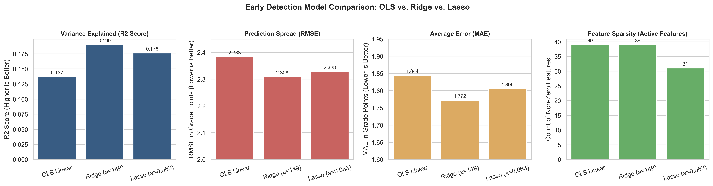
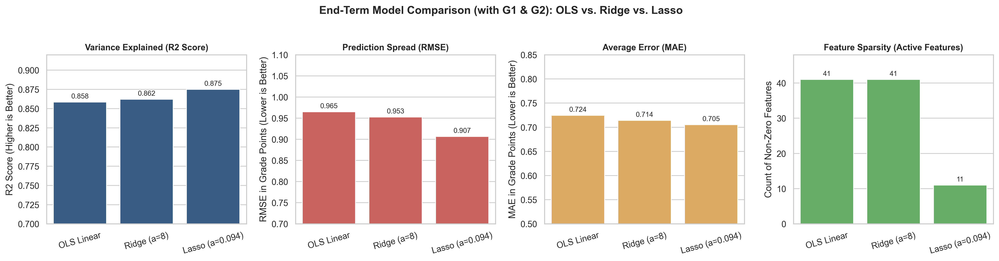
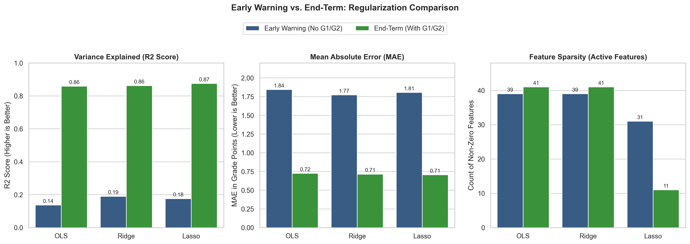

# Student Academic Performance Predictor

An end-to-end Machine Learning study built on the **Linear Regression algorithm family** (Ordinary Least Squares, Ridge, and Lasso) to forecast student academic performance (`G3`, 0 to 20 scale) across two operational regimes:
1. **Early Warning System (Day 1 of Semester)**: Predicting final marks purely from socio-economic, family, and study behavior features without test score leakage.
2. **End-Term Predictor (Post Mid-Terms)**: Predicting final marks with mid-term grades (`G1` and `G2`) incorporated.

---

## Table of Contents
- [Problem Formulation](#problem-formulation)
- [Dataset and Preprocessing](#dataset-and-preprocessing)
- [Machine Learning Architecture](#machine-learning-architecture)
- [Early-Warning Model Evaluation (No G1/G2)](#early-warning-model-evaluation-no-g1g2)
- [End-Term Model Evaluation (With G1/G2)](#end-term-model-evaluation-with-g1g2)
- [Comprehensive Regularization Comparison](#comprehensive-regularization-comparison)
- [Repository Structure](#repository-structure)
- [Installation and Quickstart](#installation-and-quickstart)
- [Automated Testing](#automated-testing)

---

## Problem Formulation

The goal is to analyze how the Linear Regression family performs under two fundamentally different data environments:

```text
1. Early Warning Formulation (Intervention-Oriented):
   Input: 30 Demographic, Parental, and Behavioral Attributes (One-Hot Encoded to 39 Features)
   Excluded: G1 (First Period Grade), G2 (Second Period Grade)
   Objective: Early identification of at-risk students before examinations begin.

2. End-Term Formulation (Accuracy-Oriented):
   Input: 30 Attributes + G1 and G2 Exam Scores (One-Hot Encoded to 41 Features)
   Objective: High-precision final score projection and feature redundancy analysis.
```

---

## Dataset and Preprocessing

The project utilizes the Portuguese secondary education student dataset (649 observations) from the UCI Machine Learning Repository.

### Preprocessing Pipeline:
1. **Target Isolation**: Target `y` (`G3`) is separated from the predictor matrix `X`.
2. **One-Hot Encoding**: Nominal variables are encoded using `drop_first=True` to prevent the Dummy Variable Trap (multicollinearity), yielding 39 features for Early Warning and 41 features for End-Term.
3. **Reproducible Split**: An 80/20 train-test split (519 train, 130 test) is fixed with `random_state=42`.
4. **Leak-Free Standardization**:
   ```text
   x_scaled = (x - mean_train) / std_train
   ```
   Z-score parameters are computed exclusively on `X_train` and applied to `X_test` and inference payloads to prevent data leakage.

---

## Machine Learning Architecture

### 1. From-Scratch Model (NumPy Batch Gradient Descent)
Implemented in `src/train.py` from mathematical first principles:
- **Hypothesis**: `y_pred = (X @ w) + b`
- **Cost Function (Mean Squared Error)**:
  ```text
  J(w, b) = (1 / (2 * m)) * sum((y_pred - y)^2)
  ```
- **Analytical Gradients**:
  ```text
  dw = (1 / m) * (X.T @ (y_pred - y))
  db = (1 / m) * sum(y_pred - y)
  ```
- **Updates**: `w = w - (lr * dw)`, `b = b - (lr * db)` with `lr = 0.01`, `epochs = 1000`.

### 2. Benchmark Model (Scikit-Learn OLS)
Closed-form Ordinary Least Squares (`sklearn.linear_model.LinearRegression`). On the held-out test set, the from-scratch engine matches Scikit-Learn to 3 decimal places (MAE: 1.8438, RMSE: 2.3826, R^2: 0.1368).

---

## Early-Warning Model Evaluation (No G1/G2)

In the Early Warning regime, mid-term test scores are excluded. The algorithms must predict final achievement solely from diffuse demographic and behavioral clues.



### Quantitative Results (Test Set, N=130):

| Model | Active Features | Zeroed Features | Best Alpha | Test MAE | Test RMSE | Test R^2 Score | Mechanism |
| :--- | :--- | :--- | :--- | :--- | :--- | :--- | :--- |
| **OLS Linear** | 39 | 0 | None | 1.8438 | 2.3826 | 0.1368 (13.7%) | Baseline OLS; fits all 39 features without shrinkage |
| **RidgeCV** | 39 | 0 | 149.0 | **1.7721** | **2.3079** | **0.1900 (19.0%)** | L2 shrinkage dampens multicollinearity across diffuse features |
| **LassoCV** | 31 | 8 | 0.0631 | 1.8051 | 2.3277 | 0.1761 (17.6%) | L1 penalty eliminates 8 noisy demographic features |

**Key Takeaway**: **Ridge wins the Early Warning task**. When many features provide weak, correlated signal, proportional shrinkage (L2) prevents individual noisy weights from dominating while retaining collective information.

---

## End-Term Model Evaluation (With G1/G2)

In the End-Term regime, mid-term exam marks (`G1` and `G2`) are included as standardized predictors alongside demographic factors.



### Quantitative Results (Test Set, N=130):

| Model | Active Features | Zeroed Features | Best Alpha | Test MAE | Test RMSE | Test R^2 Score | Mechanism |
| :--- | :--- | :--- | :--- | :--- | :--- | :--- | :--- |
| **OLS Linear** | 41 | 0 | None | 0.7245 | 0.9652 | 0.8583 (85.8%) | Unregularized fit; retains all background noise alongside tests |
| **RidgeCV** | 41 | 0 | 8.0 | 0.7141 | 0.9526 | 0.8620 (86.2%) | Mild L2 shrinkage stabilizes coefficient magnitudes |
| **LassoCV** | **11** | **30** | 0.0943 | **0.7051** | **0.9069** | **0.8749 (87.5%)** | Prunes 30 redundant features; highest accuracy and simplest model |

**Key Takeaway**: **Lasso wins the End-Term task**. Direct exam history provides dominant signal. Lasso's L1 penalty zeroes out 30 redundant demographic features, yielding the lowest MAE (0.70 grade points) and highest variance explained (87.5%).

---

## Comprehensive Regularization Comparison

A side-by-side comparison across both modeling regimes on the exact same 130-student held-out test cohort:



### Performance Matrix:

| Stage | Model | Active Features | Test MAE | Test RMSE | Test R^2 Score |
| :--- | :--- | :--- | :--- | :--- | :--- |
| **Early Warning** *(No G1/G2)* | OLS Linear | 39 | 1.8438 | 2.3826 | 0.1368 |
| | Ridge (alpha=149.0) | 39 | **1.7721** | **2.3079** | **0.1900** |
| | Lasso (alpha=0.0631) | 31 | 1.8051 | 2.3277 | 0.1761 |
| **End-Term** *(With G1/G2)* | OLS Linear | 41 | 0.7245 | 0.9652 | 0.8583 |
| | Ridge (alpha=8.0) | 41 | 0.7141 | 0.9526 | 0.8620 |
| | Lasso (alpha=0.0943) | **11** | **0.7051** | **0.9069** | **0.8749** |

### Core Machine Learning Insights:
1. **Diffuse Signal favors Ridge (L2)**: In noisy problems with many weak contributors, zeroing features throws away subtle collective signals. Ridge retains all features while shrinking variance.
2. **Sparse Signal favors Lasso (L1)**: Once dominant direct indicators (`G1`, `G2`) are known, background demographic variables become redundant noise. Lasso eliminates 30 features automatically, improving generalizability.
3. **Cross-Validation Prevents Leakage**: All hyperparameter tuning was conducted strictly via 5-fold cross-validation on training folds, preserving true test-set integrity.

---

## Repository Structure

```text
score-predictor/
|-- dataset/
|   |-- raw/
|   |   |-- student-mat.csv
|   |   |-- student-por.csv
|   |-- processed/
|       |-- X_train.csv, X_test.csv
|       |-- y_train.csv, y_test.csv
|       |-- means.csv, stds.csv
|       |-- endterm/
|           |-- X_train.csv, X_test.csv
|           |-- y_train.csv, y_test.csv
|           |-- means.csv, stds.csv
|-- model/
|   |-- scratch_model.joblib
|   |-- student_model_sklearn.joblib
|-- notebooks/
|   |-- 0-eda.ipynb
|   |-- 1-preprocessing.ipynb
|   |-- 2-modelling.ipynb
|   |-- 3-scikitlearn.ipynb
|   |-- 4-lasso.ipynb
|   |-- 5-ridge.ipynb
|   |-- endterm/
|       |-- 0-eda.ipynb
|       |-- 1-preprocessing.ipynb
|       |-- 2-ols.ipynb
|       |-- 3-lasso.ipynb
|       |-- 4-ridge.ipynb
|-- reports/
|   |-- model_evaluation_report.md
|   |-- figures/
|       |-- early_warning_comparison.png
|       |-- endterm_comparison.png
|       |-- overall_comparison.png
|-- src/
|   |-- preprocessing.py
|   |-- train.py
|   |-- predict.py
|   |-- visualize.py
|-- tests/
|   |-- test_pipeline.py
|-- requirements.txt
`-- README.md
```

---

## Installation and Quickstart

### 1. Clone Repository and Install Dependencies
```bash
git clone https://github.com/AryanSharma48/marks-predictor.git
cd marks-predictor
pip install -r requirements.txt
```

### 2. Run Data Preprocessing
```bash
python src/preprocessing.py
```

### 3. Train Models
```bash
python src/train.py
```

### 4. Run Sample Inference
```bash
python src/predict.py
```

### 5. Generate Figures
```bash
python src/visualize.py
```

---

## Automated Testing

Run the automated test suite with pytest:
```bash
pytest tests/test_pipeline.py -v
```

The test suite validates:
1. Raw dataset schema and column completeness.
2. Leak-free split and feature isolation.
3. Proper zero-mean, unit-variance standardization.
4. Correct model artifact serialization.
5. Strict output clamping within `[0.0, 20.0]`.
6. Parity between from-scratch NumPy and Scikit-Learn inference engines.
7. Graceful handling of extreme and missing inputs.
