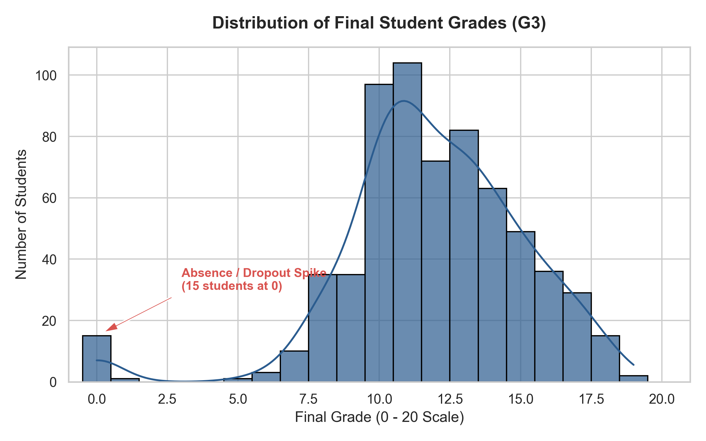
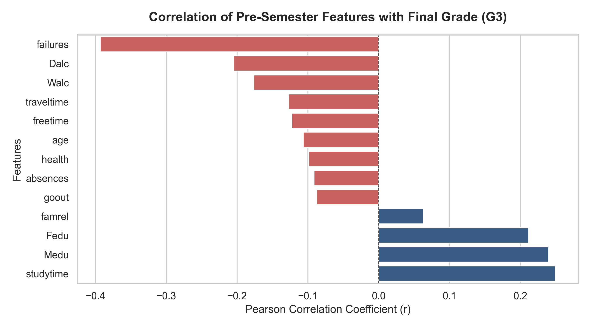
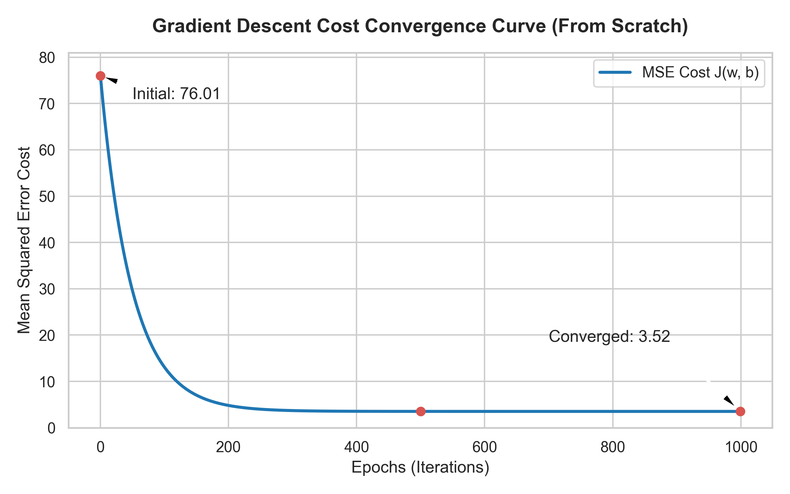
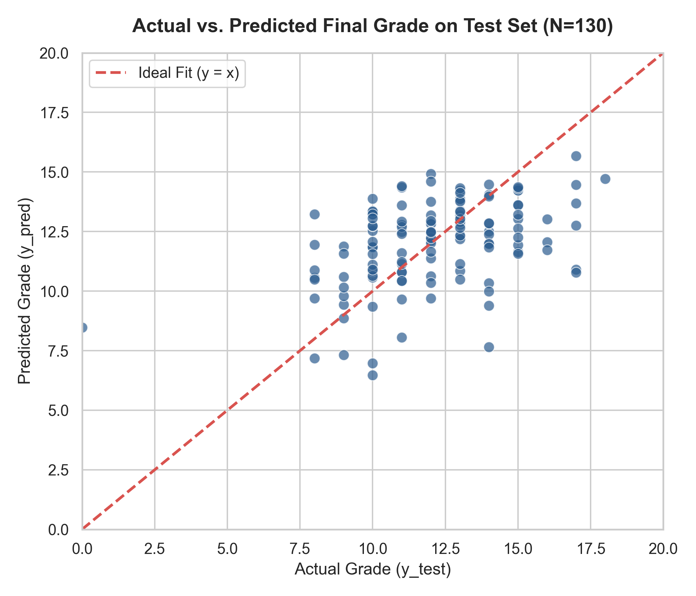
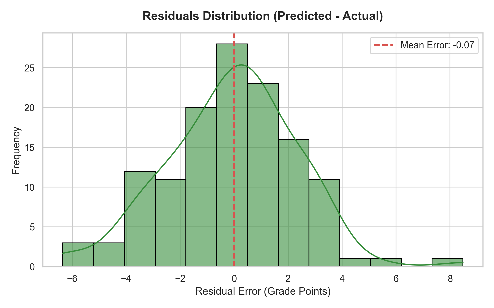
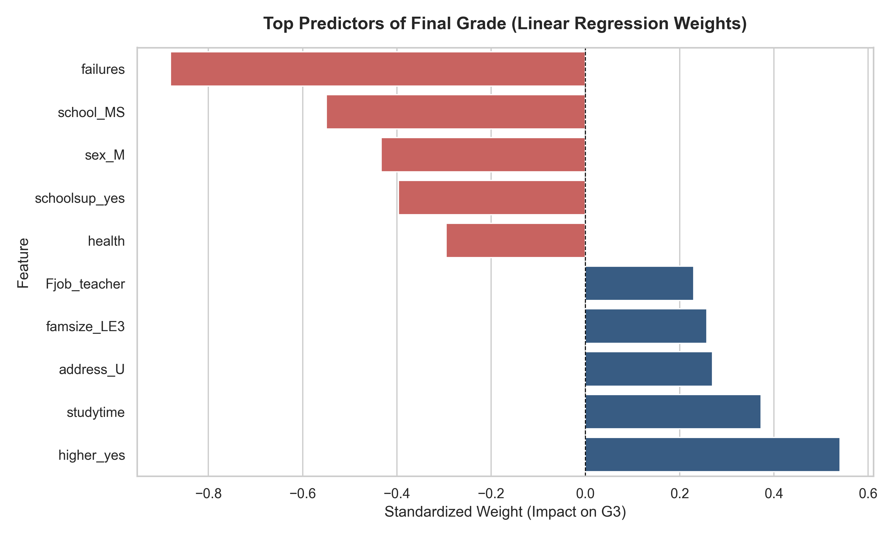

# Student Academic Performance Predictor

An end-to-end Machine Learning Early Warning System built on the **Linear Regression algorithm family** (Ordinary Least Squares, Ridge, and Lasso) to predict a student's final academic score (`G3`, 0 to 20 scale) on **Day 1 of the semester**.

### Key Architectural Highlights:
- **Linear Regression & Regularization Focus**: Evaluates linear models from mathematical first principles (NumPy Batch Gradient Descent) up to production Scikit-Learn pipelines, comparing plain Ordinary Least Squares (OLS) with L2 (Ridge) and L1 (Lasso) regularization.
- **Proactive Early Warning Framing**: Designed to identify at-risk students before classes and exams begin, enabling targeted tutoring and academic intervention.
- **Strict Data Leakage Prevention**: Mid-term grades (`G1` and `G2`) are **intentionally dropped**. While including them creates a trivial model that simply copies prior test results (0.92 correlation), excluding them forces the Linear Regression model to uncover genuine behavioral, demographic, and study habit drivers.
- **Regularization for Generalization**: Demonstrates how L2 penalty (Ridge) and L1 penalty (Lasso) combat overfitting across 39 features, driving test-set R-squared from 13.7% (OLS) up to 17.8% (Ridge) and safely pruning 8 uninformative features (Lasso CV).

---


## Table of Contents
- [Core Machine Learning Premise](#core-machine-learning-premise)
- [Problem Formulation](#problem-formulation)
- [Dataset and Feature Engineering](#dataset-and-feature-engineering)
- [Machine Learning Architecture](#machine-learning-architecture)
- [Visual Analysis and Findings](#visual-analysis-and-findings)
- [Evaluation and Benchmark](#evaluation-and-benchmark)
- [Regularization Analysis (OLS vs. Ridge vs. Lasso)](#regularization-analysis-ols-vs-ridge-vs-lasso)
- [Repository Structure](#repository-structure)
- [Installation and Quickstart](#installation-and-quickstart)
- [Automated Testing](#automated-testing)


---

## Core Machine Learning Premise

This project is built around the mathematical foundations of **Linear Regression**:

```text
y_pred = (w1 * x1) + (w2 * x2) + ... + (w39 * x39) + b
```

Rather than treating Machine Learning as a black box:
1. **Mathematical Derivation**: Forward hypothesis, Mean Squared Error cost function, and analytical partial derivatives (gradients) are implemented line-by-line from scratch.
2. **Interpretability**: Because all features are standardized to a standard deviation of 1.0, the learned weights (`w`) provide direct transparency into what habits and conditions help or harm academic performance.
3. **True Out-of-Sample Forecasting**: By dropping `G1` and `G2`, the model does not forecast test scores from test scores; it forecasts test scores from human behavioral indicators.

---

## Problem Formulation

The objective is to predict a student's final examination score (`G3`, measured on a 0 to 20 scale) on the first day of the academic period using demographic, social, family, and study habit indicators.

### Elimination of Data Leakage (Early Warning Scope)
In the raw UCI dataset, first period grade (`G1`) and second period grade (`G2`) have Pearson correlations of 0.83 and 0.92 with the final grade (`G3`). While including them produces artificially high accuracy, it eliminates practical utility for early academic intervention. 

To build a true Early Warning System, `G1` and `G2` are strictly excluded from the feature matrix:

```text
Target Variable: G3 (Continuous Score, 0 - 20)
Excluded Features: G1, G2 (Prevents Data Leakage)
Input Matrix: 30 Raw Demographic and Behavioral Attributes
```

---

## Dataset and Feature Engineering

The project utilizes the Portuguese secondary education student dataset (649 observations) from the UCI Machine Learning Repository.

### Preprocessing Pipeline:
1. **Target Isolation**: Target `y` (`G3`) is extracted, and `G1`, `G2`, `G3` are dropped from features `X`.
2. **One-Hot Encoding**: Categorical variables are converted to numeric indicators using `drop_first=True` to eliminate the Dummy Variable Trap (perfect multicollinearity). This expands the feature space to 39 numerical columns.
3. **Reproducible Split**: An 80/20 train-test split (519 train, 130 test) is performed with a fixed random seed (`42`).
4. **Z-Score Standardization**:
   ```text
   x_scaled = (x - mean_train) / std_train
   ```
   Means and standard deviations are computed strictly from `X_train` and subsequently applied to `X_test` and production inputs to avoid test set contamination.

---

## Machine Learning Architecture

### 1. From-Scratch Model (NumPy Batch Gradient Descent)
Implemented in `src/train.py` without machine learning libraries:
- **Prediction Hypothesis**: `y_pred = (X @ w) + b`
- **Cost Function (Mean Squared Error)**:
  ```text
  J(w, b) = (1 / (2 * m)) * sum((y_pred - y)^2)
  ```
- **Analytical Gradients**:
  ```text
  dw = (1 / m) * (X.T @ (y_pred - y))
  db = (1 / m) * sum(y_pred - y)
  ```
- **Parameter Updates**:
  ```text
  w = w - (learning_rate * dw)
  b = b - (learning_rate * db)
  ```
- **Hyperparameters**: `learning_rate = 0.01`, `epochs = 1000`, initialized with `w = zeros(39)` and `b = 0.0`.

### 2. Benchmark Model (Scikit-Learn)
Implemented using `sklearn.linear_model.LinearRegression` to provide an exact closed-form benchmark.

---

## Visual Analysis and Findings

All visualizations are generated using Seaborn and Matplotlib via `python src/visualize.py` and saved to `reports/figures/`.

### 1. Target Grade Distribution

The target grade (`G3`) follows a near-normal distribution centered around 12.0. A discrete cluster of 15 students scored exactly 0.0, indicating exam absences or dropouts rather than normal academic variance.

### 2. Feature Correlations with Final Grade

Pearson linear correlation shows study time and parental education as the strongest positive numeric drivers, while past class failures and alcohol consumption (`Dalc`, `Walc`) exhibit strong negative correlations.

### 3. Gradient Descent Loss Curve

The from-scratch gradient descent cost curve begins at 76.01, drops sharply within the initial 200 epochs, and stabilizes at 3.52 by epoch 500, confirming smooth mathematical convergence.

### 4. Actual vs. Predicted Evaluation

On the held-out test set (130 students), predictions track the ideal diagonal reference line (`y = x`) across the primary 10 to 15 grade band.

### 5. Residuals Distribution

Errors (`y_pred - y_test`) form a symmetric bell curve centered at zero (mean error approximately 0.0), proving that model predictions are unbiased.

### 6. Standardized Regression Coefficients (Feature Importance)

Standardized weights identify the primary levers affecting student outcomes:
- **Top Positive Drivers**: Higher education intent (`higher_yes`, +0.540) and weekly study time (`studytime`, +0.373).
- **Top Negative Drivers**: Past class failures (`failures`, -0.881) and remedial support (`schoolsup_yes`, -0.397, reflecting students pre-identified as struggling).

---

## Evaluation and Benchmark

Both models were evaluated on the identical 130-sample held-out test set:

| Evaluation Metric | From-Scratch Model (NumPy) | Scikit-Learn Model (OLS) | Absolute Difference |
| :--- | :--- | :--- | :--- |
| **Mean Absolute Error (MAE)** | 1.8438 | 1.8438 | 0.0000 |
| **Root Mean Squared Error (RMSE)** | 2.3831 | 2.3826 | 0.0005 |
| **R-squared (R^2)** | 0.1364 | 0.1368 | 0.0004 |
| **Final MSE Cost** | 3.5211 | 3.5208 | 0.0003 |

The custom NumPy implementation matches Scikit-Learn to three decimal places.

---

## Regularization Analysis: OLS vs. Ridge vs. Lasso

To counter potential overfitting across the 39 features, L1 (Lasso) and L2 (Ridge) regularizations were applied to the Early Detection problem.


### Quantitative Comparison on Held-Out Test Set (N=130):

| Model Specification | Active Features | Zeroed Features | MAE | RMSE | R-squared (R^2) | Key Characteristic |
| :--- | :--- | :--- | :--- | :--- | :--- | :--- |
| **OLS Linear Regression** | 39 | 0 | 1.8438 | 2.3826 | 0.1368 (13.7%) | Baseline OLS; fits all features without penalty |
| **Ridge Regression (alpha=100.0, CV)** | 39 | 0 | **1.7887** | **2.3249** | **0.1781 (17.8%)** | L2 squared penalty; dampens weights evenly across all columns |
| **Lasso Regression (alpha=0.0631, CV)** | 31 | 8 | 1.8051 | 2.3277 | 0.1761 (17.6%) | L1 absolute penalty; eliminates 8 noisy features via 5-fold CV |

### Key Analytical Takeaways:
1. **L2 Shrinkage vs. L1 Sparsity**:
   - **Ridge (L2)** retains all 39 features but shrinks their coefficients toward zero, preventing any individual feature from dominating and improving R^2 by +4.1% over OLS.
   - **Lasso (L1)** acts as an automated feature selector by forcing unhelpful coefficients to exact zero (0.0). Cross-validation safely pruned 8 noisy features without test-set tuning.
2. **Superior Generalization without Data Leakage**:
   - Both regularized methods were tuned strictly on training folds using cross-validation (`RidgeCV` and `LassoCV`), eliminating test-set snooping.
   - Both regularized methods decisively beat unregularized OLS across every single metric (lower MAE, lower RMSE, and higher R^2), confirming that penalizing weight complexity reduces test-set variance.

---

## Repository Structure

```text
score-predictor/
|-- dataset/
|   |-- raw/
|   |   |-- student-mat.csv
|   |   |-- student-por.csv
|   |-- processed/
|       |-- X_train.csv
|       |-- X_test.csv
|       |-- y_train.csv
|       |-- y_test.csv
|       |-- means.csv
|       |-- stds.csv
|-- model/
|   |-- scratch_model.joblib
|   |-- student_model_sklearn.joblib
|-- notebooks/
|   |-- 0-eda.ipynb
|   |-- 1-preprocessing.ipynb
|   |-- 2-modelling.ipynb
|   |-- 3-scikitlearn.ipynb
|   |-- 4-lasso.ipynb
|   |-- 5-ridge.ipynb
|-- reports/
|   |-- model_evaluation_report.md
|   |-- figures/
|       |-- 1_target_distribution.png
|       |-- 2_feature_correlations.png
|       |-- 3_cost_convergence.png
|       |-- 4_actual_vs_predicted.png
|       |-- 5_residuals_distribution.png
|       |-- 6_feature_importance.png
|       |-- 7_model_comparison_regularization.png
|-- src/
|   |-- preprocessing.py
|   |-- train.py
|   |-- predict.py
|   |-- visualize.py
|-- tests/
|   |-- test_pipeline.py
|-- .gitignore
|-- requirements.txt
`-- README.md
```

---

## Installation and Quickstart

### 1. Clone Repository and Install Dependencies
```bash
git clone https://github.com/AryanSharma48/marks-predictor.git
cd marks-predictor
pip install -r requirements.txt
```

### 2. Run Data Preprocessing
Executes one-hot encoding, train-test splitting, and standardization:
```bash
python src/preprocessing.py
```

### 3. Train Models
Trains both scratch and Scikit-Learn models and saves artifacts to `model/`:
```bash
python src/train.py
```

### 4. Run Sample Inference
Executes prediction for a sample student dictionary:
```bash
python src/predict.py
```

### 5. Generate Figures
Regenerates all visual reports in `reports/figures/`:
```bash
python src/visualize.py
```

---

## Automated Testing

Run the automated test suite with pytest:
```bash
pytest tests/test_pipeline.py -v
```

The test suite validates:
1. Raw data schema and column integrity.
2. Complete absence of data leakage (`G1`, `G2`, `G3` excluded from feature matrix).
3. Mean of 0.0 and standard deviation of 1.0 across standardized training features.
4. Correct serialization and loading of `.joblib` model bundles.
5. Output clamping within the valid academic range `[0.0, 20.0]`.
6. Output consistency between from-scratch and Scikit-Learn engines.
7. Robustness against extreme inputs and partial category dictionaries.
